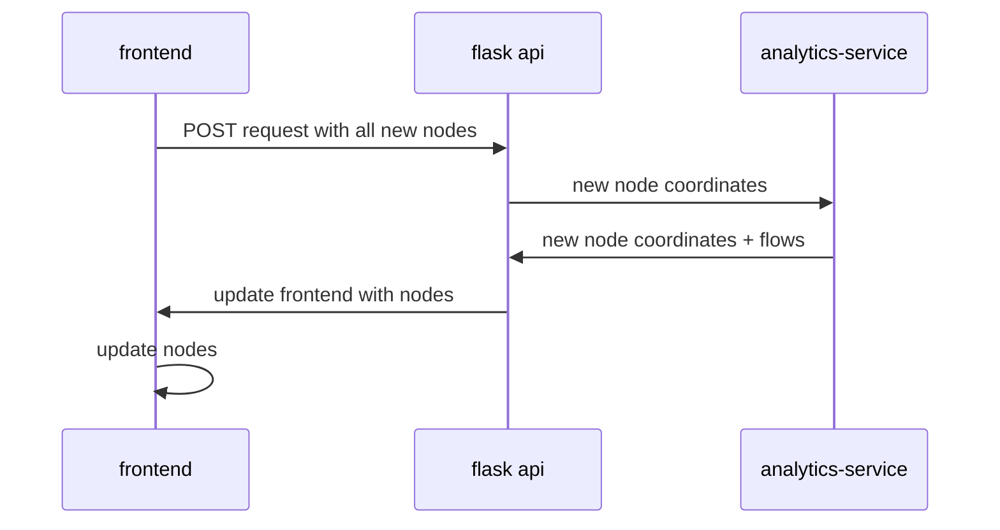

# Initial architecture draft

- We need to specify what we're doing. If we want to find places where a person should add a new bike stop, we need to really understand what are the key questions we have to answer to know how this will affect the graph flows. 